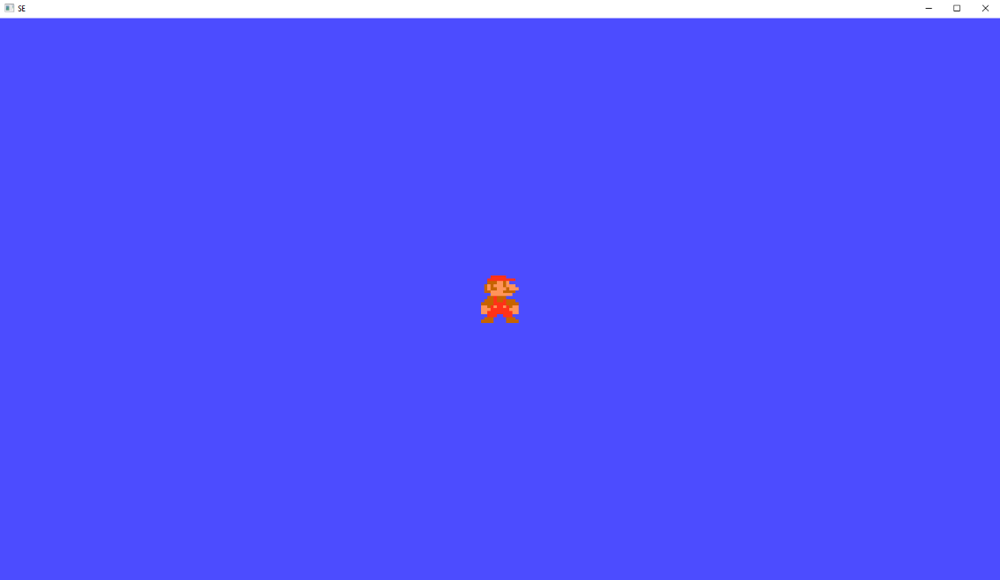

# SHITTY ENGINE (SE)



## Compiler configuration:
```
You will have to configure your compiler to work with 32 bits applications.
```

## Capabilities:
For now only can render textures :c

## Pendient:

+  Hight Priority 
   * Input Events
   * Collision
   * Sound
  
+ Low Priority
   * Editor
   * Visual Scripting
